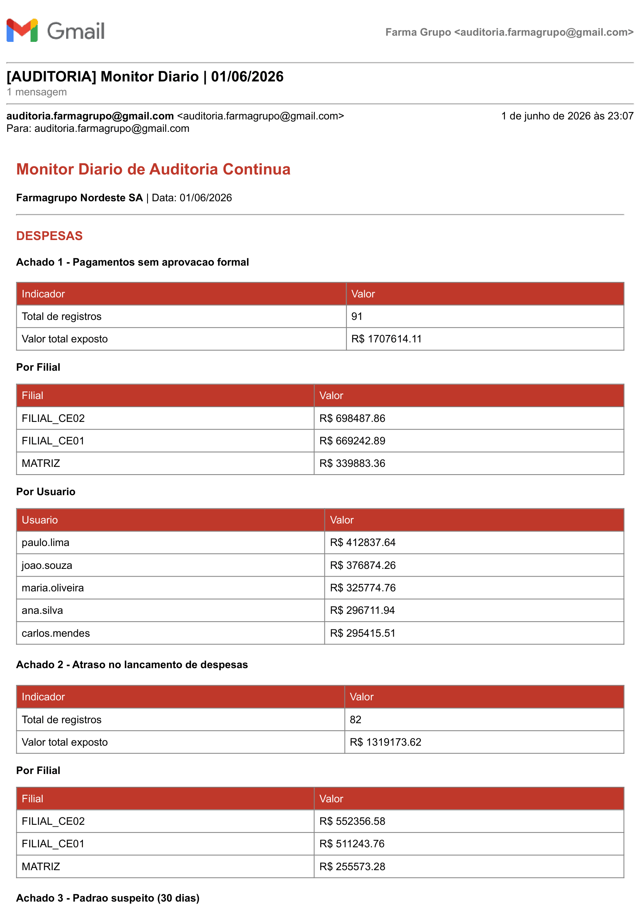
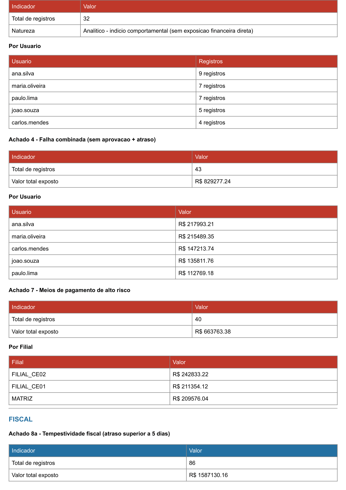
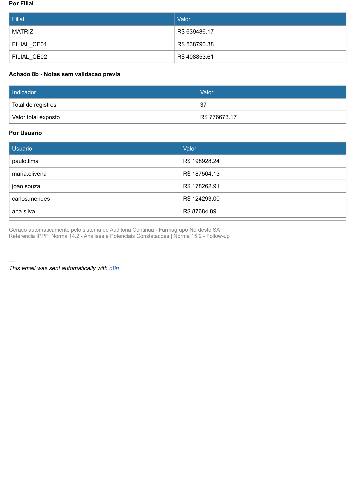

# Portfolio de Auditoria Interna - Farmagrupo Nordeste SA

> Empresa fictícia criada exclusivamente para fins de portfólio profissional.

---

## 1. Contexto do projeto

A Auditoria Interna moderna não pode depender apenas de revisões periódicas e amostragens. Em ambientes com alto volume de transações, falhas de controle se acumulam silenciosamente entre um ciclo e outro e quando identificadas, o impacto já é significativo.

Este projeto nasce da minha busca por ingressar na função de Auditoria Interna com uma contribuição real: Utilizar análise de dados como caminho para ampliar a cobertura, reduzir o tempo de detecção e estruturar o acompanhamento das recomendações de forma rastreável.

A Farmagrupo Nordeste SA é uma empresa fictícia do setor farmacêutico com três unidades (Matriz, Filial CE01 e Filial CE02), criada para simular um ambiente realista de auditoria contínua.

---

## 2. Objetivo do projeto

Construir um sistema de **auditoria contínua orientada a dados**, seguindo o **Global Internal Audit Standards 2024 (IPPF)** do IIA, cobrindo desde a modelagem do banco de dados até o dashboard executivo, com automação de alertas e relatórios.

Os objetivos específicos foram:

* **Modelar um banco de dados de auditoria com rastreabilidade completa por achado.**
* **Desenvolver 10 testes de auditoria em SQL com 100% de cobertura das transações.**
* **Formalizar 9 achados no padrão IPPF 2024** (Criterio, Condicao, Causa, Efeito, Recomendacao).
* **Automatizar o monitoramento via n8n** com alertas e relatorio executivo semanal.
* **Visualizar os resultados em dashboard executivo no Power BI** com 5 paginas e 15 medidas DAX.

---

## 3. Sobre o uso de IA no projeto

Usei o **Claude (Anthropic)** como ferramenta de aprendizado e orientação técnica ao longo de todo o desenvolvimento.

A IA não construiu o projeto por mim. Ela me auxiliou a entender o porquê de cada decisão antes de avançar. Cada query SQL foi digitada por mim. Cada medida DAX foi criada com entendimento do conceito. Cada achado foi defendido e trabalhado meu próprio raciocínio.

Entendia para avançar.

A IA foi a ferramenta de auxilio, trabalhando o meu aprendizado e o raciocínio.

---

## 4. Stack tecnológica

* **PostgreSQL (Neon)** - banco de dados com 3 tabelas e 421 registros de auditoria em nuvem.
* **SQL (pgAdmin)** - 10 testes de auditoria com 100% de cobertura das transações.
* **n8n Cloud** - 2 workflows de automação (monitor diário + relatório executivo semanal).
* **Power BI Desktop** - dashboard executivo com 5 páginas e 15 medidas DAX documentadas.

\---

## 5\. Estrutura do banco de dados

O banco foi modelado com três tabelas no PostgreSQL hospedado no Neon:

* **`despesas`** — 200 registros de lançamentos com aprovação, forma de pagamento, filial e usuário
* **`fiscal`** — 200 registros de documentos fiscais (NF-e e NFS-e) com tempestividade e validação
* **`log_auditoria`** — 421 registros vinculados aos 9 achados por `achado\_id`, com ciclo de vida completo (ABERTO → EM\_ANDAMENTO → ENCERRADO)

Uma decisão técnica relevante foi o SLA diferenciado por tabela:

* **Despesas:** atraso superior a 10 dias — impacto no fechamento contábil
* **Fiscal:** atraso superior a 5 dias — prazo menor pela necessidade de escrituração tempestiva e obrigações acessórias (SPED e EFD)

---

## 6. Os 10 testes de auditoria

Cada teste replica um critério de auditoria em SQL, referenciado a uma norma específica do IPPF 2024. A análise cobre 100% das transações — sem amostragem.

* **Testes 1, 2 e 3** — Pagamentos sem aprovação: volume, percentual e impacto financeiro → **Achado 1**
* **Teste 4** — Atraso no lançamento de despesas superior a 10 dias → **Achado 2**
* **Teste 5** — Padrão suspeito: atrasos de exatamente 30 dias → **Achado 3**
* **Teste 6** — Falha combinada: sem aprovação E atraso simultâneos → **Achado 4**
* **Teste 7** — Segregação de função: TOD e TOE → **Achado 5**
* **Teste 8** — Concentração por usuário e centro de custo → **Achado 6**
* **Teste 9** — Risco por forma de pagamento (CHQ e DIN) → **Achado 7**
* **Teste 10a** — Tempestividade fiscal: atraso superior a 5 dias → **Achado 8**
* **Teste 10b** — Notas fiscais sem validação prévia → **complementa o Achado 8**
* **Teste 10c** — Concentração de volume fiscal em poucos fornecedores → **Achado 9**

---

## 7\. Os 9 achados de auditoria

Todos os achados foram formalizados no padrão IPPF com Critério, Condição, Causa, Efeito e Recomendação, e incluídos no Relatório de Auditoria AI-2025-001.

|#|Título|Risco|Prioridade|Condição|
|-|-|-|-|-|
|1|Falha no Controle de Autorização de Pagamentos|🔴 ALTO|CRÍTICA|101 transações — R$ 1.916.609,80|
|2|Falha de Tempestividade no Lançamento de Despesas|🔴 ALTO|CRÍTICA|82 registros com atraso > 10 dias|
|3|Padrão Suspeito de Comportamento (30 dias exatos)|🔴 ALTO|CRÍTICA|32 registros — indício de adequação deliberada ao limite|
|4|Falha Combinada de Controle e Processo|🔴 ALTO|CRÍTICA|43 transações com dupla falha — R$ 829.277,24|
|5|Segregação de Função — TOE Ineficaz|🔴 ALTO|CRÍTICA|Analítico — TOD adequado / TOE ineficaz (mesmas transações do Achado 1)|
|6|Distribuição Sistêmica por Usuário e CC|🔴 ALTO|ALTA|Analítico — falha sistêmica de processo — nenhuma combinação > 4% do total|
|7|Uso de Meios de Pagamento com Baixa Rastreabilidade|🔴 ALTO|ALTA|40 lançamentos CHQ+DIN — R$ 663.763,38|
|8|Falha no Processo Fiscal (atraso + sem validação)|🔴 ALTO|ALTA|86 com atraso — R$ 1.587.130,16 + 37 sem validação|
|9|Concentração de Fornecedores — Risco Operacional|🟡 MÉDIO|NORMAL|Analítico — 5 fornecedores = 100% do volume fiscal|

**Nota:** Os Achados 5 e 6 analisam os mesmos registros dos Achados 1 e 2 sob perspectivas diferentes — segregação de função e distribuição sistêmica. Para preservar a integridade do log e evitar dupla contagem, não possuem registros transacionais individuais no log\_auditoria.

---

## 8. Automação com n8n

Dois workflows implementam a auditoria contínua na prática.

### WF01 - Monitor Diário de Auditoria

Roda todo dia às 07h. Consulta os critérios dos achados no PostgreSQL e envia e-mail HTML com alertas por nível de risco, filial e usuário. 
Referência: **Norma 14.2 - Análises e Potenciais Constatações do Trabalho**.








### WF02 — Relatório Executivo Semanal

Roda toda segunda-feira às 08h00. Consolida a posição atual do log_auditoria com novos achados, prazos críticos e volume financeiro monitorado. 
Referência: **Norma 15.2 - Confirmação da Implementação das Recomendações**.


---

## 9. Dashboard Power BI — Visão Geral

Esta página oferece a visão executiva consolidada do portfólio de auditoria.

* **Total de registros no log de auditoria**
* **Volume financeiro monitorado**
* **Registros encerrados (follow-up ativo)**
* **Volume financeiro por achado (barras decrescentes)**
* **Volume por filial**
* **Volume por usuário (deduplificado)**
* **Distribuição dos achados por prioridade (CRÍTICA: 5 / ALTA: 3 / NORMAL: 1)**

!\[Visão Geral](assets/dashboard\_visao\_geral.png)

\---

## 10\. Dashboard Power BI — Despesas

Foco nos achados de controle de despesas (Achados 1, 2, 3, 4 e 7).

* **Exposição sem aprovação — R$ 1.916.609,80 (Achado 1)**
* **% Despesas sem aprovação — 54,12%**
* **Despesas por forma de pagamento**
* **Despesas por centro de custo**
* **Exposição sem aprovação por usuário**

!\[Despesas](assets/dashboard\_despesas.png)

\---

## 11\. Dashboard Power BI — Fiscal

Foco no Achado 8 — tempestividade e validação fiscal.

* **Tempestividade fiscal por filial (atraso > 5 dias) — R$ 1.587.130,16**
* **Volume fiscal por tipo de documento (NF-e vs NFS-e)**
* **Notas sem validação prévia por fornecedor — R$ 776.673,17**

!\[Fiscal](assets/dashboard\_fiscal.png)

\---

## 12\. Dashboard Power BI — Fornecedores

Foco no Achado 9 — concentração de volume fiscal.

* **Concentração de volume fiscal por fornecedor**
* **Participação percentual por fornecedor**
* **Volume por natureza da operação**

Insight-chave: 5 fornecedores representam 100% do volume fiscal. A ruptura de qualquer um impacta diretamente a operação sem alternativa imediata.

!\[Fornecedores](assets/dashboard\_fornecedores.png)

\---

## 13\. Dashboard Power BI — Follow-up (Norma 15.2)

Esta página implementa o acompanhamento das recomendações exigido pela Norma 15.2 do IPPF.

* **Registros abertos (411) e Achados críticos (258)**
* **Indicador de achados pendentes de resolução**
* **Tabela completa dos 9 achados com nível de risco, prioridade, valor e status**
* **Distribuição por prioridade de tratamento**
* **Nota metodológica explicando Achados 5, 6 e 9**

O sistema responde em tempo real: quando o status é atualizado para ENCERRADO no banco, o indicador reflete automaticamente na próxima atualização.

!\[Follow-up](assets/dashboard\_followup.png)

\---

## 14\. Principais insights do projeto

* **R$ 1,9M em pagamentos sem aprovação formal** — 58,7% de todas as transações acima de R$ 5k
* **43 transações com dupla falha (sem aprovação + atraso)** — R$ 829.277,24 sem qualquer barreira de detecção
* **32 registros com exatamente 30 dias de atraso** — padrão estatisticamente improvável para erro operacional
* **5 fornecedores concentram 100% do volume fiscal** — risco operacional sem alternativas homologadas
* **Sistema de follow-up ativo** — 10 registros já encerrados demonstram o ciclo completo da Norma 15.2

\---

## 15\. Estrutura do repositório

```
sql/
    01\_queries\_tabelas.sql
    02\_queries\_testes\_auditoria.sql
assets/
    email\_monitor\_diario.png
    dashboard\_visao\_geral.png
    dashboard\_despesas.png
    dashboard\_fiscal.png
    dashboard\_fornecedores.png
    dashboard\_followup.png
README.md
```

\---

## 16\. O que pretendo estudar e desenvolver a seguir

Este projeto me mostrou o quanto ainda tenho a aprender. Os próximos passos são evoluções que pretendo estudar conforme avanço na transição de carreira:

* **Aprofundar o estudo do IPPF 2024** — ainda estou nos primeiros domínios e quero entender cada norma com a mesma profundidade que apliquei neste projeto
* **Demonstrações Financeiras** — cruzar os achados com DRE e Balanço para mostrar impacto no resultado
* **Auditoria de Supply Chain** — estudar como a auditoria se aplica ao processo de compras e fornecedores
* **Python para análise de dados** — ampliar a capacidade analítica além do SQL

\---

## 17\. Referências utilizadas

* **IIA Global Internal Audit Standards 2024 (IPPF)** — base normativa de todo o projeto
* **SQL Guia Prático** — Alice Zhao — referência de estudo para as queries
* **Storytelling com Dados** — Cole Nussbaumer Knaflic — referência para o design do dashboard

\---

## 18\. Autor

**Matheus Rodrigues Lopes**

Graduado em Ciências Contábeis | Analista Fiscal/Tributário em transição para Auditoria Interna

* **LinkedIn:** [https://www.linkedin.com/in/matheuslopesr/](https://www.linkedin.com/in/matheuslopesr/)
* **GitHub:** [https://github.com/mrlopes15](https://github.com/mrlopes15)

